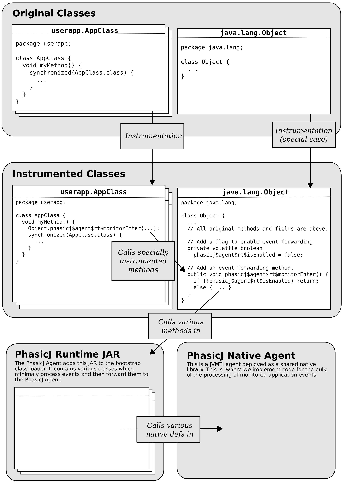

# Module: PhasicJ Agent Runtime

The PhasicJ Agent Runtime is responsible for recieving monitored application
events generated by instrumentation sites and forwarding these to other
PhasicJ components.

## Purpose of This Document

In this document, we attempt to explain how it is used within a JVM
application monitored by PhasicJ, why we have given it this responsibility and
why we have designed it as we have.

There is one particular peculiarity of the design that we attempt to explain:
the PhasicJ Agent's special-case instrumentation of `java.lang.Object`.

This document is meant for PhasicJ developers and curious PhasicJ users.

## Event Monitoring Overview

## Background

The [PhasicJ Agent][1] is a JVMTI agent (a.k.a. a native agent). It is
deployed as a native shared library (i.e., as a `.so` or `.dylib` file). When
a user's JVM application is configured to use our PhasicJ agent, our agent
uses the JVMTI interface to interact with and monitor the user's JVM
application.

JVMTI is a powerful interface. A JVMTI agent can drastically alter the behaivor
of the JVM application. It is thus a guiding principle of PhasicJ's design and
implementation that we attempt to minimize our interference of the natural
behavior of the user's application. But, in order to sufficiently monitor the
user applciation, some amount of modification seems unavoidable.

## The Runtime Processes and Forwards Monitored Events

Currently, we monitor user application events via a combination of JVMTI events
and bytecode instrumentation. The code in the [`instr`][2] package implements
the code which actually performs bytecode instrumentation. The added
instrumentation sites call the PhasicJ Agent Runtime, [`rt`][3], as the first
step in processing events generated from bytecode instrumented sites.

The PhasicJ Agent Runtime is the direct receiver of these monitored
application events. For example, whenever the user application performs a
`MONITORENTER` instruction in some class `C`, the instrumentation in class
`C` should collect relevant information about this event and then forward
this information to the PhasicJ Agent Runtime. By "forward" here we just
mean a regular method call within the user's JVM from the user's application
code to our PhasicJ Agent Runtime code.

As we said above, we want the PhasicJ Agent to only minimally influence the
user's application. In particular, we want to minimize the amount and
complexity of PhasicJ code that we execute inside of the user's application
JVM. Thus, we have made it the responsibility of the PhasicJ Agent Runtime to
get information out of the user's JVM and to forward it to other PhasicJ
components with only minimal processing.

## Calling the Runtime From Instrumentation Sites

The PhasicJ Agent may instrument any class in the user's JVM, even Java
standard library classes. Our design needs to ensure that, at run-time, any
added field accesses and method calls will be resolved to some actually
available class definitions. We don't want our instrumentation to trigger any
`NoClassDefFoundError`s.

To make our PhasicJ Agent Runtime class definitions available at all
instrumentation sites, even those in the Java standard library, we use the
JVMTI interface to add a JAR containing these Runtime classes to the user
application's bootstrap class loader's search path (a.k.a. the boot
class-path).

Unfortunately, the JVM cannot even read from our Runtime JAR added in this
way before it has been initialized to a certain point. Therefore, even if we
use the JVMTI interface to add our Runtime JAR as early as possible, our
instrumentation sites can't use the classes in this JAR until after this
point in JVM startup. Essentially, during early JVM startup, there is only a
limited set of class definitions which can be used, and we cannot extend this
set. We want this set to be instrumented, and we want them to be run, but we
can't let `NoClassDefFoundError`s occur.

Fortunately, we can work around this problem by using instrumentation to modify
the definitions of classes within this set. Instead of having our
instrumentation sites call into our Runtime classes directly, we have them call
a class which we know will always be defined, even very early in JVM startup:
`java.lang.Object`. It turns out that JVMTI lets us instrument even `Object`.

We use this capability to add some methods and fields to `Object`. These
methods and fields are used to forward monitored events from instrumentation
sites to the Runtime classes only *after* the JVM is initialized enough to
support loading the Runtime classes from the JAR file.

The class `phasicj.agent.rt.JavaLangObjectAmendment` defines the set of fields
and methods which we add to `java.lang.Object` to support this forwarding.

---

[1]: /phasicj/agent
[2]: /phasicj/agent/instr
[3]: /phasicj/agent/rt
